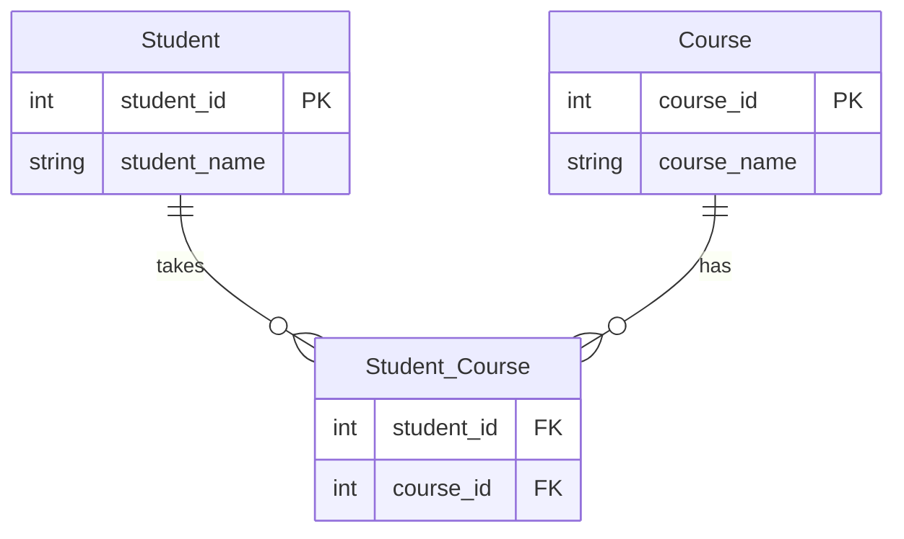
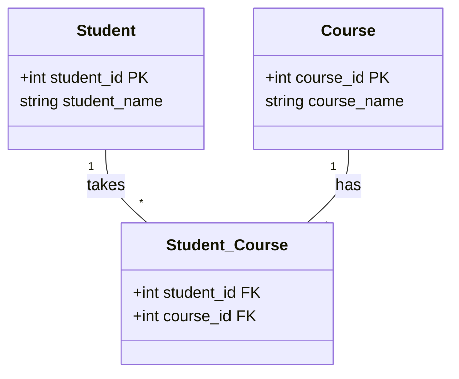
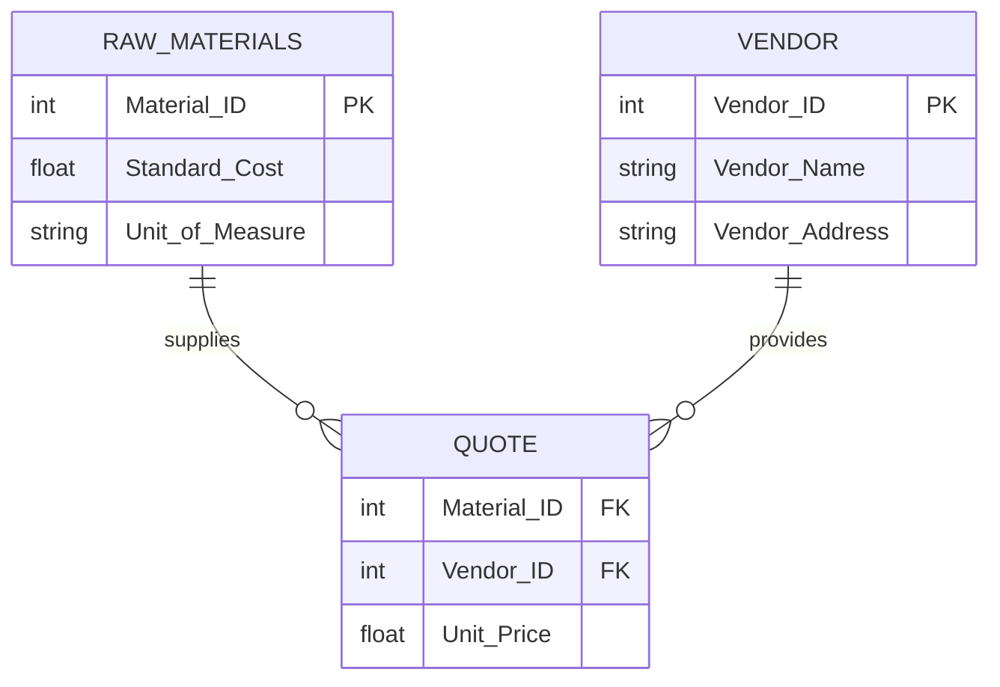
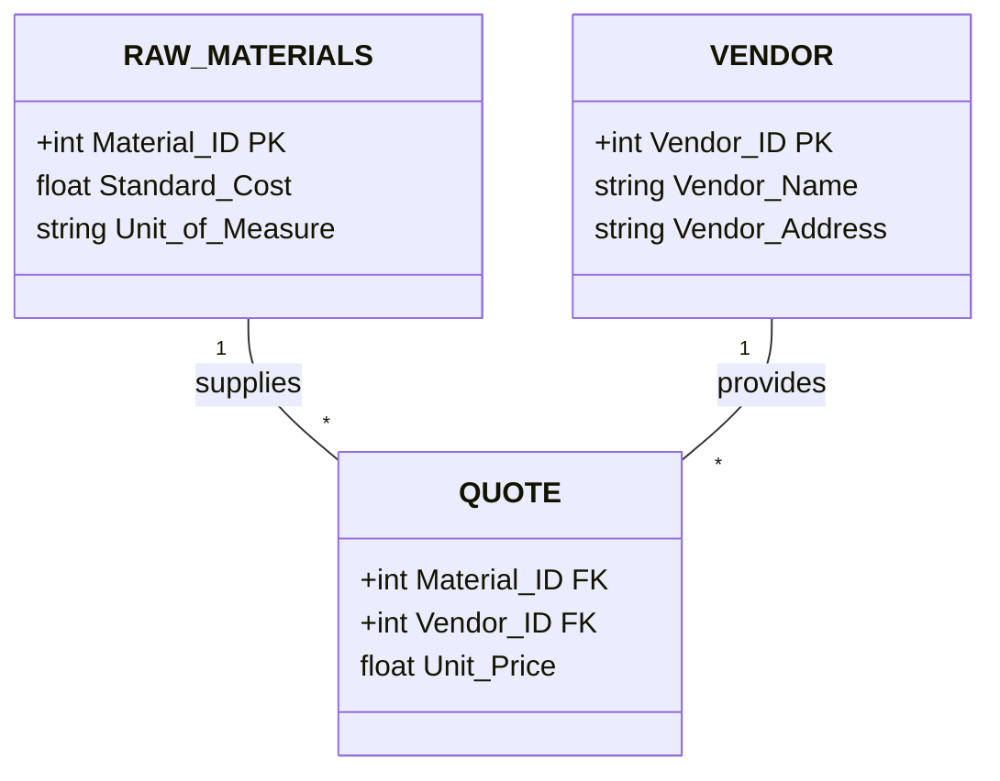
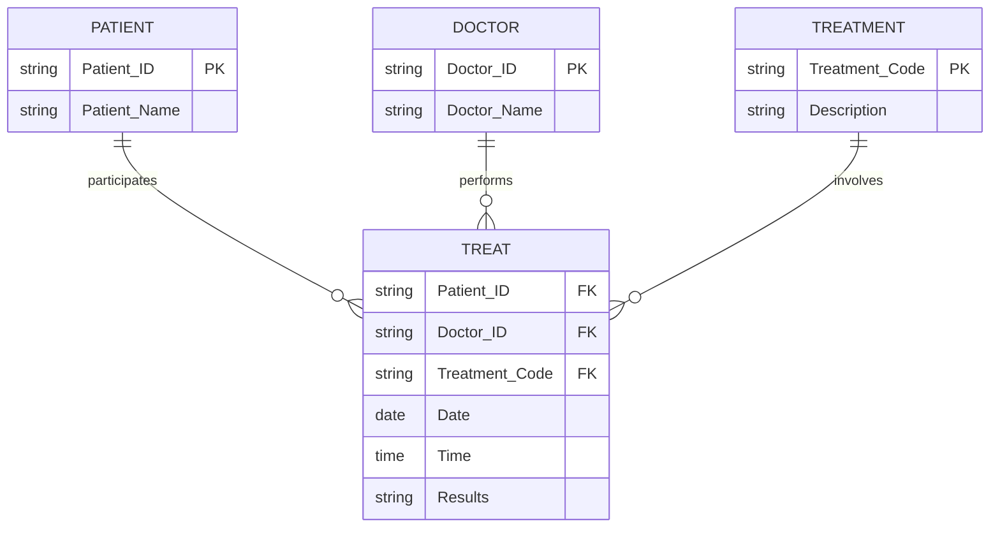
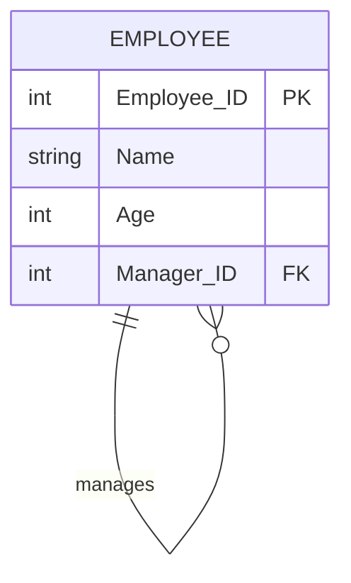
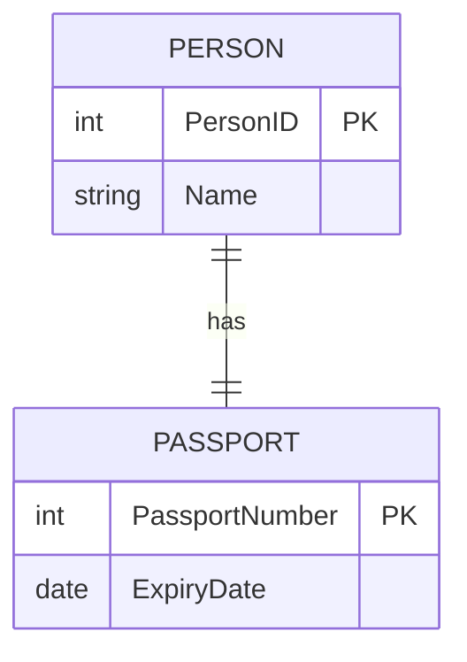

# Database Mapping: One-to-One Relationships

## Degrees of Relations in ERD

In Entity-Relationship Diagrams (ERD), we have three degrees of relations:

1. **Binary** (3 cases)
   - One-to-One (3 cases)
   - One-to-Many (2 cases)
   - Many-to-Many (1 case)
2. **Ternary** (1 case)
3. **Unary** (1 case)

## Binary One-to-One Relationships

### Case 1: Total Participation from Both Sides

In this case, each entity in both related entity sets must participate in the relationship.

#### Example: Employee and Computer

Scenario: Each employee has exactly one computer, and each computer is assigned to exactly one employee.

##### Approach 1: Single Table

We can combine both entities into a single table:

| Employee_ID (PK) | Employee_Name | Computer_ID | Computer_Name |
|------------------|---------------|-------------|---------------|
| E001             | John Doe      | C001        | Dell XPS      |
| E002             | Jane Smith    | C002        | MacBook Pro   |

**Advantages:**
- Good performance for queries involving both entities
- Ensures total participation

**Considerations:**
- Choose the primary key based on the more dominant entity (e.g., Employee_ID)

##### Approach 2: Separate Tables

We might use two tables in cases where:
- We want to avoid null values
- We need to prevent data duplication

**Employee Table:**

| Employee_ID (PK) | Employee_Name |
|------------------|---------------|
| E001             | John Doe      |
| E002             | Jane Smith    |

**Computer Table:**

| Computer_ID (PK) | Computer_Name | Employee_ID (FK) |
|------------------|---------------|-------------------|
| C001             | Dell XPS      | E001              |
| C002             | MacBook Pro   | E002              |

**Note:** The foreign key in the Computer table ensures the one-to-one relationship.

### Other Cases of One-to-One Relationships

1. Partial participation from one side
2. Optional participation from both sides

These cases introduce the possibility of null values and require careful consideration in the database design.

---

## Next Steps

In the following sections, we'll explore:
- One-to-Many relationships
- Many-to-Many relationships
- Ternary relationships
- Unary relationships

We'll discuss their characteristics, mapping strategies, and provide examples for each case.

# Database Mapping: One-to-One Relationships

## Degrees of Relations in ERD

In Entity-Relationship Diagrams (ERD), we have three degrees of relations:

1. **Binary** (3 cases)
   - One-to-One (3 cases)
   - One-to-Many (2 cases)
   - Many-to-Many (1 case)
2. **Ternary** (1 case)
3. **Unary** (1 case)

## Binary One-to-One Relationships

### Case 1: Total Participation from Both Sides

[Content remains the same as in the previous version]

### Case 2: Partial Participation from One Side

In this case, one entity has total participation while the other has partial (optional) participation.

#### Example: Employee and Computer (Employee is optional)

Scenario: Every computer must be assigned to an employee, but not every employee needs to have a computer.

##### Approach: Separate Tables

We use two separate tables to avoid null values in the mandatory side.

**Employee Table:**

| Employee_ID (PK) | Employee_Name |
|------------------|---------------|
| E001             | John Doe      |
| E002             | Jane Smith    |
| E003             | Bob Johnson   |

**Computer Table:**

| Computer_ID (PK) | Computer_Name | Employee_ID (FK) |
|------------------|---------------|-------------------|
| C001             | Dell XPS      | E001              |
| C002             | MacBook Pro   | E002              |

**Note:** 
- The foreign key is in the "total" participation table (Computer).
- Some employees may not have a computer (e.g., E003).
- Every computer must be assigned to an employee.

### Case 3: Optional Participation from Both Sides

In this case, participation is optional for both entities. This typically requires a third table to represent the relationship.

#### Example: Employee and Car

Scenario: An employee may or may not own a car, and a car may or may not be owned by an employee.

##### Approach: Three Tables

**Employee Table:**

| Employee_ID (PK) | Employee_Name |
|------------------|---------------|
| E001             | John Doe      |
| E002             | Jane Smith    |

**Car Table:**

| Car_ID (PK) | Car_Type    |
|-------------|-------------|
| C001        | Sedan       |
| C002        | SUV         |

**Employee_Car Table:**

| Employee_ID (FK, PK) | Car_ID (FK) |
|----------------------|-------------|
| E001                 | C002        |

**Notes:**
- The Employee_Car table represents the relationship.
- Either Employee_ID or Car_ID can be the primary key of the Employee_Car table.
- An employee will appear at most once in the Employee_Car table.
- A car will appear at most once in the Employee_Car table.

## Summary of One-to-One Relationships

1. **Total from both sides:** Can use a single table or two tables with a foreign key in either.
2. **Partial from one side:** Use two tables, with the foreign key in the "total" participation table.
3. **Optional from both sides:** Use three tables, with a separate table for the relationship.

As the degree of optionality increases, the number of tables typically increases to maintain data integrity and avoid null values.

---

## Next Steps

In the following sections, we'll explore:
- One-to-Many relationships
- Many-to-Many relationships
- Ternary relationships
- Unary relationships

We'll discuss their characteristics, mapping strategies, and provide examples for each case.

## Binary One-to-Many Relationships

In one-to-many relationships, we focus primarily on the "many" side, as it's the side that can cause data repetition. The "one" side's optionality (whether it's total or partial) is less critical for the database structure. One-to-many relationships have two main cases:

### Case 1: Mandatory Many

In this case, the entity on the "many" side must participate in the relationship.

#### Example: Department and Employees

Scenario: A department has many employees, and every employee must belong to a department.

##### Approach: Foreign Key in the "Many" Table

**Department Table:**

| Dept_ID (PK) | Dept_Name |
|--------------|-----------|
| D001         | HR        |
| D002         | IT        |

**Employee Table:**

| Emp_ID (PK) | Emp_Name   | Dept_ID (FK) |
|-------------|------------|--------------|
| E001        | John Doe   | D001         |
| E002        | Jane Smith | D002         |
| E003        | Bob Johnson| D001         |

**Notes:**
- The primary key of the "one" side (Department) is used as a foreign key in the "many" side (Employee).
- This approach prevents data repetition, as department information is not repeated for each employee.
- Every employee must have a department (mandatory participation).

### Case 2: Optional Many

In this case, the entity on the "many" side may or may not participate in the relationship.

#### Example: Employee and Project

Scenario: An employee may work on a project, but it's not mandatory. A project can have multiple employees.

##### Approach: Separate Relationship Table

**Employee Table:**

| Emp_ID (PK) | Emp_Name   |
|-------------|------------|
| E001        | John Doe   |
| E002        | Jane Smith |
| E003        | Bob Johnson|

**Project Table:**

| Proj_ID (PK) | Proj_Name     |
|--------------|---------------|
| P001         | Website Redesign |
| P002         | Mobile App    |

**Proj_Emp Table (Relationship Table):**

| Emp_ID (FK, PK) | Proj_ID (FK) |
|-----------------|--------------|
| E001            | P001         |
| E002            | P001         |
| E002            | P002         |

**Notes:**
- We create a third table (Proj_Emp) to represent the relationship.
- The primary key of the "many" side (Employee) is used as both a foreign key and part of the primary key in the relationship table.
- This structure allows employees to work on multiple projects and projects to have multiple employees.
- Employees who are not assigned to any project won't appear in the Proj_Emp table.

## Summary of One-to-Many Relationships

1. **Mandatory Many:** Use a foreign key in the "many" table, referencing the "one" table.
2. **Optional Many:** Use a separate relationship table to link the "one" and "many" entities.

The choice between these approaches depends on whether participation in the relationship is mandatory or optional for the "many" side.

---

## Next Steps

In the following sections, we'll explore:
- Many-to-Many relationships
- Ternary relationships
- Unary relationships

We'll discuss their characteristics, mapping strategies, and provide examples for each case.

# Entity, Attribute, and Relationship Mapping to Database Tables

[Previous content remains unchanged]

## 8. Mapping Many-to-Many Relationships

Many-to-many relationships require special handling in relational databases. They are characterized by multiple entities on both sides of the relationship that can be associated with multiple entities on the other side.

### Basic Many-to-Many Relationship

For a basic many-to-many relationship:

1. Create separate tables for each entity
2. Create a junction table (also called association or linking table)
3. The junction table contains foreign keys from both related entities
4. The primary key of the junction table is a composite key of these foreign keys

#### Example: Students and Courses

Table representation:

#### Example: Students and Courses

Student Table:

| Student_ID (PK) | Student_Name |
|-----------------|--------------|
| S001            | Alice Johnson|
| S002            | Bob Smith    |

Course Table:

| Course_ID (PK) | Course_Name |
|----------------|-------------|
| C001           | Mathematics |
| C002           | History     |

Student_Course Table:

| Student_ID (FK) | Course_ID (FK) |
|-----------------|----------------|
| S001            | C001           |
| S001            | C002           |
| S002            | C001           |

### Many-to-Many Relationship with Attributes

When a many-to-many relationship has its own attributes:

1. Follow the same steps as the basic many-to-many relationship
2. Add columns to the junction table for the relationship attributes

#### Example: Raw Materials and Vendors

Table representation:

RAW_MATERIALS Table:

| Material_ID (PK) | Standard_Cost | Unit_of_Measure |
|------------------|---------------|-----------------|
| M001             | 10.50         | Kilograms       |
| M002             | 5.25          | Liters          |

VENDOR Table:

| Vendor_ID (PK) | Vendor_Name | Vendor_Address |
|----------------|-------------|----------------|
| V001           | Acme Corp   | 123 Main St    |
| V002           | XYZ Supplies| 456 Oak Ave    |

QUOTE Table:

| Material_ID (FK) | Vendor_ID (FK) | Unit_Price |
|------------------|----------------|------------|
| M001             | V001           | 11.00      |
| M001             | V002           | 10.75      |
| M002             | V001           | 5.50       |

## Conclusion

Understanding these mapping techniques, especially for many-to-many relationships and the use of composite primary keys, is crucial for effective database design. These approaches ensure that we can represent complex real-world relationships in our relational database structures while maintaining data integrity and efficiency.

Remember, while we've covered five main cases for composite primary keys, there are seven total cases for mapping binary relationships in database design. The many-to-many scenario, with or without attributes, represents one of these important cases.

## 9. Mapping Ternary Relationships

Ternary relationships involve three entities and have only one scenario for mapping, regardless of cardinality or participation constraints.

### Example: Patient, Doctor, and Treatment

Based on the provided ER diagram and resulting tables:

ER Diagram (simplified representation):

Resulting Tables:

PATIENT Table:

| Patient_ID (PK) | Patient_Name |
|-----------------|--------------|
| P001            | John Smith   |
| P002            | Mary Johnson |

DOCTOR Table:

| Doctor_ID (PK) | Doctor_Name   |
|----------------|---------------|
| D001           | Dr. Brown     |
| D002           | Dr. Williams  |

TREATMENT Table:

| Treatment_Code (PK) | Description      |
|---------------------|------------------|
| T001                | X-ray            |
| T002                | Blood Test       |

PATIENT_TREATMENT Table:

| Patient_ID | Doctor_ID | Treatment_Code | Date       | Time     | Results           |
|------------|-----------|----------------|------------|----------|-------------------|
| P001       | D001      | T001           | 2023-09-15 | 10:30:00 | Normal            |
| P002       | D002      | T002           | 2023-09-16 | 14:45:00 | Vitamin D deficient|
| P001       | D002      | T002           | 2023-09-17 | 09:15:00 | Normal            |

Note: In the PATIENT_TREATMENT table, (Doctor_ID, Date, Time) forms the composite primary key.

In this ternary relationship:
1. We create a table for each entity (PATIENT, DOCTOR, TREATMENT).
2. We create a fourth table (PATIENT_TREATMENT) to represent the ternary relationship.
3. The PATIENT_TREATMENT table includes foreign keys from all three entity tables.
4. The composite primary key for PATIENT_TREATMENT is chosen to ensure uniqueness. In this case, (Doctor_ID, Date, Time) forms the composite primary key.

This mapping approach for ternary relationships represents the fifth case where we use a composite primary key.

## Composite Primary Key Cases

We've now encountered five cases where composite primary keys are used:

1. Mapping multi-valued attributes
2. Mapping complex attributes that are both composite and multi-valued
3. Mapping weak entities
4. Mapping many-to-many relationships (with or without attributes)
5. Mapping ternary relationships

These five cases cover the main scenarios where composite primary keys are necessary in database design. They help maintain data integrity, avoid redundancy, and accurately represent complex relationships in the database schema.

## 10. Considerations for Composite Primary Keys

While composite primary keys can be useful in certain scenarios, it's generally recommended to:

1. Avoid composite primary keys when possible for better performance and simplicity.
2. If a composite primary key is necessary, limit it to two or three columns.
3. Prefer numeric columns for composite primary keys to improve indexing efficiency.

These considerations can impact database performance, especially when it comes to indexing, which we'll discuss in more detail later.

## 11. Mapping Unary (Self-Referential) Relationships

Unary relationships, also known as self-referential or recursive relationships, occur when an entity has a relationship with itself. A common example is employees being managed by other employees.

### Example: Employee Self-Management

ER Diagram:

Table Representation:

| Employee_ID (PK) | Name  | Age | Manager_ID (FK) | IsMarriedTo |
|------------------|-------|-----|-----------------|-------------|
| 1                | Ahmed | 50  | NULL            | 2           |
| 2                | Aya   | 30  | 1               | 1           |
| 3                | Omar  | 29  | 1               | NULL        |
| 4                | Doaa  | 22  | 2               | NULL        |

In this example:
- The EMPLOYEE table includes a Manager_ID column, which is a foreign key referencing the Employee_ID of the manager.
- The Manager_ID can be NULL for employees who don't have a manager (e.g., the top-level manager).
- We've also included an IsMarriedTo column to demonstrate another type of self-referential relationship.

This approach allows for representing hierarchical relationships within a single table, which is efficient for queries involving employee-manager relationships.

## Composite Primary Key Cases (Final Update)

The main cases where composite primary keys are used include:

1. Mapping multi-valued attributes
2. Mapping complex attributes (composite and multi-valued)
3. Mapping weak entities
4. Mapping many-to-many relationships
5. Mapping ternary relationships

However, as noted earlier, it's generally advisable to use single-column primary keys where possible, especially for large tables or those frequently involved in joins.

# Entity, Attribute, and Relationship Mapping to Database Tables

## 12. Mapping Rules Summary

When mapping an ER diagram to a relational database schema, there are 8 essential rules or steps to follow. These rules ensure a good database design that accurately represents the relationships and attributes of the entities. Let's start with the first two rules:

### Rule 1: One-to-One Relationship (Total Participation on Both Sides)

When dealing with a one-to-one relationship where both entities have total participation:

1. Combine the two entities into a single table.
2. Choose one of the two entity's keys to be the primary key for the combined table.

Example:

ER Diagram:

Resulting Table:

| PersonID (PK) | Name | PassportNumber | ExpiryDate |
|---------------|------|----------------|------------|
| 1             | John | A12345         | 2025-12-31 |
| 2             | Jane | B67890         | 2024-06-30 |

### Rule 2: Mapping Regular (Strong) Entities

When mapping a regular (strong) entity:

1. Create a table for the entity.
2. Map attributes based on their type:
   a. Simple attributes: Place as-is in the table.
   b. Multi-valued attributes: Create a separate table.
   c. Composite attributes: Map individual components.
   d. Complex attributes: Create a separate table.

#### 2a. Simple Attributes

Map directly to columns in the entity's table.

Example:

| EmployeeID (PK) | Name  | Age |
|-----------------|-------|-----|
| 1               | Alice | 30  |
| 2               | Bob   | 35  |

#### 2b. Multi-valued Attributes

Create a separate table with a foreign key referencing the main entity's primary key. The primary key of this new table is a composite of the foreign key and the multi-valued attribute.

Example: Employee Skills

Main Table (EMPLOYEE):

| EmployeeID (PK) | Name  |
|-----------------|-------|
| 1               | Alice |
| 2               | Bob   |

Separate Table (EMPLOYEE_SKILLS):

| EmployeeID (FK) | Skill (PK) |
|-----------------|------------|
| 1               | Java       |
| 1               | Python     |
| 2               | C++        |

#### 2c. Composite Attributes

Map the individual components of the composite attribute to separate columns in the main entity's table.

Example:

| EmployeeID (PK) | FirstName | LastName | StreetAddress | City  | ZipCode |
|-----------------|-----------|----------|---------------|-------|---------|
| 1               | Alice     | Johnson  | 123 Main St   | NYC   | 10001   |
| 2               | Bob       | Smith    | 456 Elm St    | LA    | 90001   |

#### 2d. Complex Attributes

Create a separate table for the complex attribute. Include the main entity's primary key as a foreign key in this new table. The primary key of the new table is a composite of the foreign key and one of the complex attribute's components.

Example: Employee Contact Information

Main Table (EMPLOYEE):

| EmployeeID (PK) | Name  |
|-----------------|-------|
| 1               | Alice |
| 2               | Bob   |

Separate Table (EMPLOYEE_CONTACT):

| EmployeeID (FK) | ContactType | ContactValue | IsPrimary |
|-----------------|-------------|--------------|-----------|
| 1               | Email       | alice@ex.com | Yes       |
| 1               | Phone       | 1234567890   | No        |
| 2               | Email       | bob@ex.com   | Yes       |

In this case, (EmployeeID, ContactType) could form the composite primary key.

